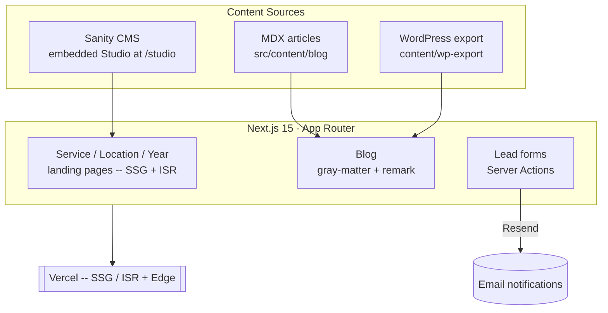

# Phone Mast Advice

**Independent UK advisory for landowners with telecom masts** — rebuilt from
WordPress into a fast, SEO-first **Next.js 15** site with a headless CMS.

**Live:** [phonemast-nextjs.vercel.app](https://phonemast-nextjs.vercel.app)

## Screenshots


---

## Overview

Phone Mast Advice helps UK landowners secure fair terms on telecom mast
leases — rent reviews, lease renewals, mast sales, removals, and more. The
original site ran on WordPress; this project migrates it to **Next.js 15
(App Router)** with a **Sanity** headless CMS, MDX articles, and a heavy
focus on SEO and Core Web Vitals.

**Why the rebuild?**

- WordPress was slow and awkward to extend with bespoke lead-capture tools.
- Marketing needed programmatic landing pages — per service, per location, per year.
- The content team needed modern editing without touching code or waiting on deploys.

---

## Features

- **Headless CMS** — Sanity Studio embedded at `/studio`; editors publish without deploys
- **MDX blog** — long-form articles via `gray-matter` + `remark`, with per-post imagery
- **Programmatic SEO** — generated service pages (`/phone-mast-services/*`), location pages (`/locations/[location]`), and year-targeted landing pages (`/phone-mast-lease-2026`, `/phone-mast-rent-2026`)
- **Lead tools** — Free Lease Check and Free Rent Estimate forms backed by Server Actions + email delivery (Resend)
- **Operator directory** — dynamic `/[operator]` pages for major UK network operators
- **SEO built-in** — `next-sitemap`, structured metadata, and image optimization
- **Consent & analytics** — GDPR consent gate + analytics via `@next/third-parties`
- **WordPress import** — original content preserved under `content/wp-export`

---

## Architecture



---

## Tech Stack

| Layer | Technology |
|-------|-----------|
| Framework | Next.js 15 (App Router), React 19, TypeScript |
| CMS | Sanity — embedded Studio, `next-sanity`, `@sanity/image-url` |
| Content | MDX via `gray-matter` + `remark` / `remark-html` |
| Styling | styled-components · Framer Motion (`motion`) |
| Email | Resend (lead-form notifications) |
| SEO | `next-sitemap`, structured metadata |
| Analytics | `@next/third-parties` + consent gate |
| Deploy | Vercel |

---

## Project Structure

```
src/
├── app/
│   ├── phone-mast-services/     # service pages: rent reviews, renewals, sales…
│   ├── locations/[location]/    # programmatic location pages
│   ├── [operator]/              # per-operator pages
│   ├── free-lease-check/        # lead-capture tool
│   ├── free-rent-estimate/      # lead-capture tool
│   ├── blog/[slug]/             # MDX articles
│   ├── studio/                  # embedded Sanity Studio
│   └── actions/                 # Server Actions (forms, email)
├── components/                  # UI, analytics, consent
├── content/blog/                # MDX posts
└── lib/                         # Sanity client, helpers
sanity/schemas/                  # CMS content models
content/wp-export/               # original WordPress content
```

---

## Getting Started

```bash
pnpm install
pnpm dev            # http://localhost:3000
                    # Sanity Studio at /studio
```

Set in `.env.local`: Sanity project id + dataset, and the Resend API key.

## Deploy

Auto-deploys to Vercel on push to `main`. The sitemap is regenerated
post-build via `next-sitemap`.

## License

MIT
